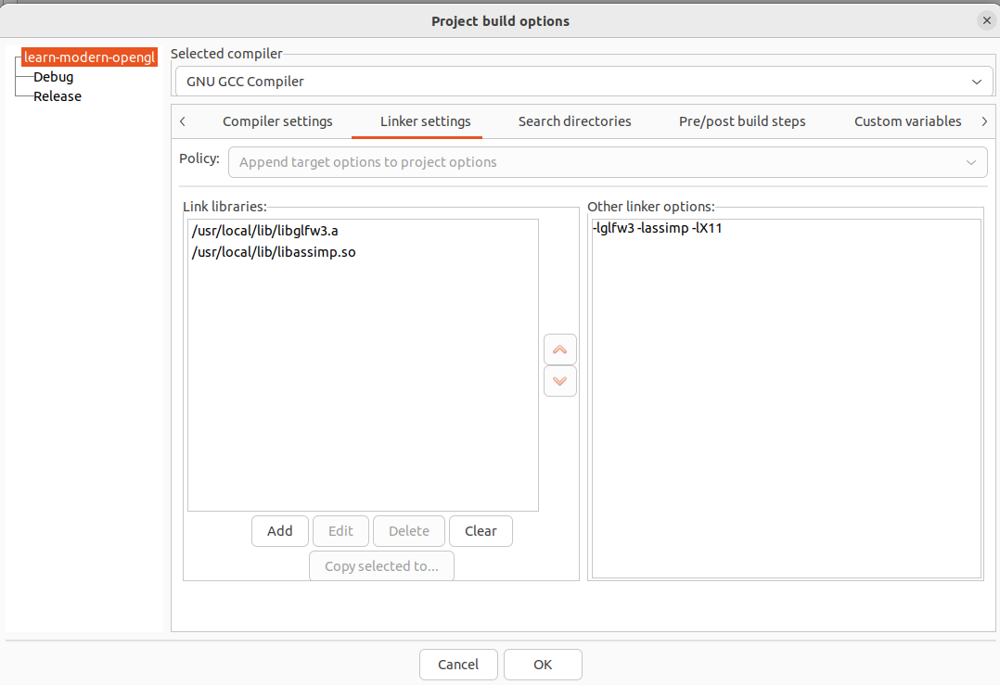
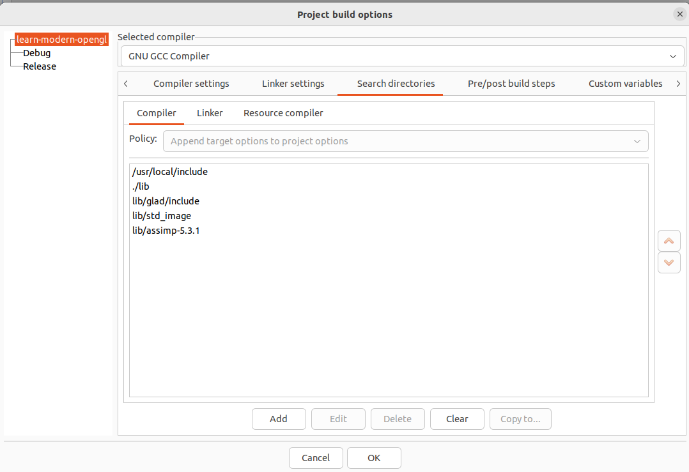
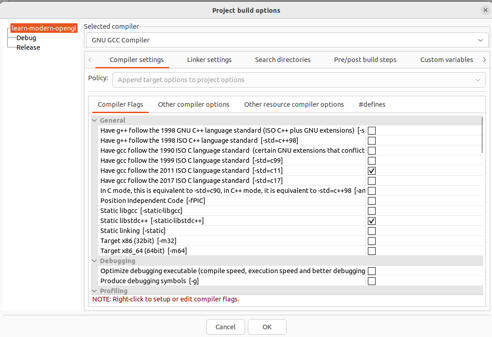
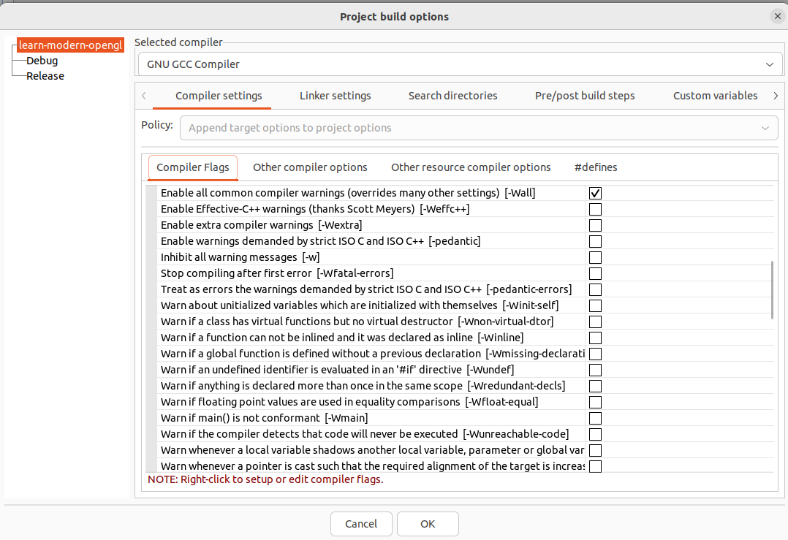
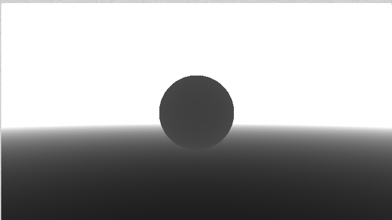
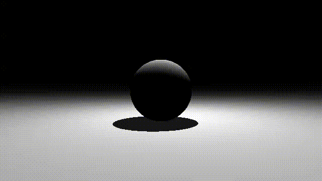
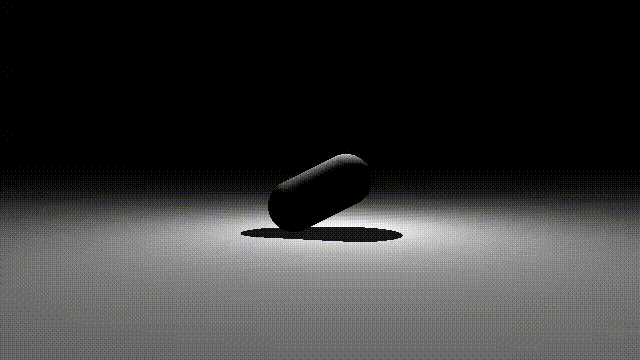
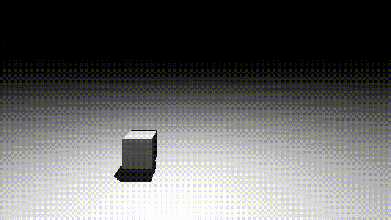

# Ray-Marching Shader with OpenGL

Projeto para criar efeitos gráficos usando Ray Marching

Atualmente, shaders do site [ShaderToy](https://www.shadertoy.com/) que usam ```iMouse``` e ```iTime``` são compatíveis com a aplicação, temos como exemplo o [christmas](https://www.shadertoy.com/view/3dVfDc) e o [structures](https://www.shadertoy.com/view/Ms2SDc)

Ao longo do desenvolvimento, será implementado mais features, deixando ainda mais compatível com o [ShaderToy](https://www.shadertoy.com/)

## 📋 Instalações das dependências (Linux)

### Instalação da lib X11

```
sudo apt-get install doxygen dnf xorg-dev
sudo dnf install libXcursor-devel libXi-devel libXinerama-devel libXrandr-devel
```

### Instalação da lib GLFW (GLFW-3.3.8)

Baixar o pacote [GLFW-3.3.8](https://www.glfw.org/download)

Após baixar, extrair e faça a compilação usando os comandos dentro da pasta ```glfw-3.3.8```

```
cmake -S . -B build
cmake build
cd build
make build
sudo make install
```

Ao finalizar, será exibido no terminal, os locais de instalações das libs e os includes como pode ser visto na imagem abaixo:


### Instalação do Assimp (Assimp-5.3.1)

Baixe o Assimp [assimp-5.3.1](https://github.com/assimp/assimp)
após baixar, extrair e faça a sua build

```
cd assimp
cmake CMakeLists.txt 
cmake --build .
```

após fazer a build, copie os arquivos ```.so``` para a pasta ```/usr/local/lib``` e crie um atalho do ```libassimp.so.5``` para a 
pasta principal do projeto clonado

## 🔧 Configuração do CodeBlock

Verifique se a configuração do seu codeblock como segue as imagens a seguir:






Pronto, o Codeblock está configurado

### 🚀 Executando um exemplo

Depois que a aplicação já estiver compilada, passe como argumento a pasta do ```shader.vs``` e ```shader.fs```

Exemplo de utilização com aplicação em modo ```Debug``` 

👽 Exemplo no ```Linux```
```
./bin/Debug/raymarching-shader-opengl './glsl/ex_02/'
```

👽 Exemplo no ```Windows```
```
bin/Debug/raymarching-shader-opengl.exe './glsl/ex_02/'
```

Exemplo de utilização com aplicação em modo ```Release``` (No linux)

👽 Exemplo no ```Linux```
```
./bin/Release/raymarching-shader-opengl './glsl/ex_02/'
```

👽 Exemplo no ```Windows```
```
bin/Release/raymarching-shader-opengl.exe './glsl/ex_02/'
```

Lembrando que a pasta deve conter um ```shader.vs``` e um ```shader.fs```


O exemplo [christmas](https://www.shadertoy.com/view/3dVfDc) e [structures](https://www.shadertoy.com/view/Ms2SDc) foram tirados do ShaderToy para teste

### Exemplo [Christmas](https://www.shadertoy.com/view/3dVfDc)


### Exemplo [Structures](https://www.shadertoy.com/view/Ms2SDc)


### Exemplo 1 (Sphere + Plane)


### Exemplo 2 (Sphere + Plane + Light)


### Exemplo 3 (Capsule)


### Exemplo 4 (Torus)


### Exemplo 5 (Cube)


